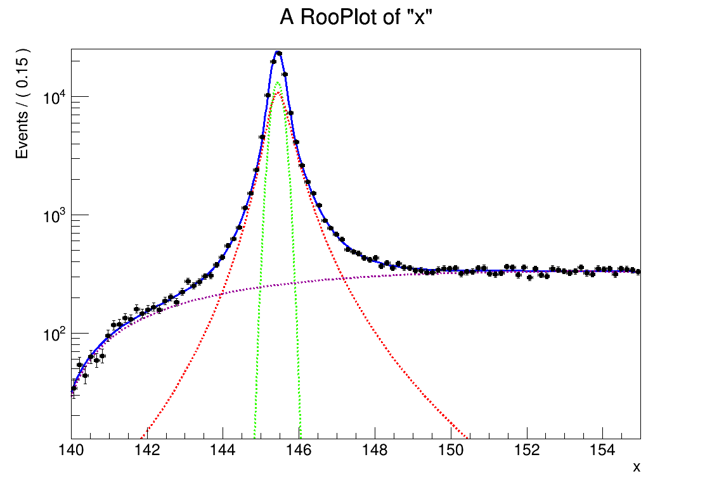
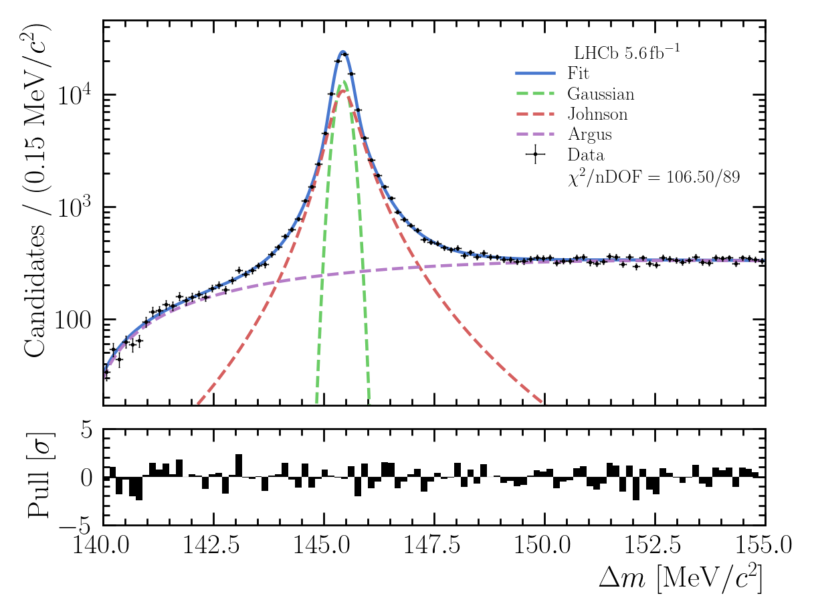

# RooFit-to-MPL

to get the package, do \
`$ git clone git@github.com:aburke1605/RooFit-to-MPL.git`

add the package to your python interpreter by doing \
`$ export PYTHONPATH=$PYTHONPATH:path/to/RooFit-to-MPL`

allow for intellisense recognition in VS code by doing the following in your base directory \
`$ echo "PYTHONPATH=$PYTHONPATH:path/to/RooFit-to-MPL" > .env`


to run the example do
```shell
$ python -i
>>> from Utils import Example
>>> Example()
```
which generates the example plots `"mpl_figure_plot.pdf"` and `"root_canvas_plot.pdf"`:
 